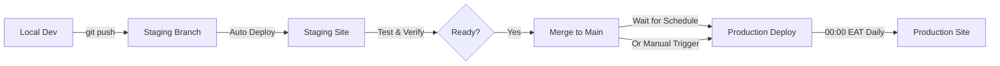

# Production Deployment Workflow

## Overview

Your deployment strategy is now optimized for:
- ✅ **Fast iteration** on staging
- ✅ **Controlled releases** to production
- ✅ **Minimal Contentful API usage** (ISR + scheduled deploys)
- ✅ **Automatic daily updates** to production

## Branch Strategy

### Staging Branch
- **Purpose**: Testing and development
- **Auto-deploy**: ✅ Enabled
- **Trigger**: Every push to `staging` branch
- **URL**: https://staging.admi.africa (or Amplify staging URL)
- **Use for**: Testing new features, content updates, bug fixes

### Main Branch (Production)
- **Purpose**: Live production website
- **Auto-deploy**: ❌ Disabled
- **Trigger**: Scheduled (daily at midnight EAT) OR manual
- **URL**: https://admi.africa
- **Use for**: Stable, tested code only

## Deployment Flow



## Daily Workflow

### 1. Development & Testing (Throughout the day)
```bash
# Make changes locally
git checkout staging
git add .
git commit -m "feat: your changes"
git push origin staging

# Amplify automatically deploys to staging
# Test at: https://staging.admi.africa
```

### 2. Merging to Production (When ready)
```bash
# Merge staging to main
git checkout main
git merge staging
git push origin main

# Production will deploy at next scheduled time (midnight)
# OR trigger manual deploy (see below)
```

### 3. Automatic Production Deploy (Daily at 00:00 EAT)
- Lambda function triggers Amplify deploy automatically
- No manual intervention needed
- Fresh content from ISR revalidation

## Manual Production Deploy

If you need to deploy to production immediately (outside of schedule):

### Option 1: AWS Console
1. Go to https://console.aws.amazon.com/amplify
2. Select your app: `admi-website`
3. Select branch: `main`
4. Click **"Redeploy this version"**

### Option 2: AWS CLI
```bash
AWS_PROFILE=admi-website aws amplify start-job \
  --app-id dlm0hjalapt7d \
  --branch-name main \
  --job-type RELEASE \
  --region us-east-1
```

### Option 3: Run Lambda Manually
```bash
AWS_PROFILE=admi-website aws lambda invoke \
  --function-name admi-website-production-deploy \
  --region us-east-1 \
  response.json
```

### Option 4: Trigger via Node Script
```bash
node infrastructure/scripts/trigger-production-deploy.js
```

## Schedule Configuration

### Current Schedule
- **Time**: 00:00 EAT (21:00 UTC previous day)
- **Frequency**: Daily
- **Cron Expression**: `cron(0 21 * * ? *)`

### Changing the Schedule

Edit the CloudFormation parameter:

```bash
AWS_PROFILE=admi-website aws cloudformation update-stack \
  --stack-name admi-website-scheduled-deploy \
  --use-previous-template \
  --parameters ParameterKey=ScheduleExpression,ParameterValue="cron(0 21 * * ? *)" \
  --capabilities CAPABILITY_NAMED_IAM \
  --region us-east-1
```

**Common Schedules:**
- Every 6 hours: `cron(0 */6 * * ? *)`
- Twice daily (00:00 & 12:00 EAT): `cron(0 21,9 * * ? *)`
- Once daily at 02:00 EAT: `cron(0 23 * * ? *)`
- Weekdays only at midnight: `cron(0 21 ? * MON-FRI *)`

## Content Update Flow

### How ISR Works with Scheduled Deploys

1. **Build Time** (when deploy happens):
   - Homepage & courses fetched from Contentful
   - Static pages generated
   - Cached for 1 hour

2. **Runtime** (between deploys):
   - ISR regenerates pages every hour automatically
   - No Contentful API calls for cached pages
   - Stale content served if Contentful fails

3. **Daily Deploy** (00:00 EAT):
   - Fresh build with latest content
   - All pages regenerated
   - Cache reset

### Content Freshness

| Content Type | Maximum Staleness |
|--------------|-------------------|
| Homepage | 1 hour (ISR) |
| Courses | 1 hour (ISR) |
| News/Events | Real-time (still SSR) |
| Forms | Real-time |

## Hotfix Workflow

If you need to fix a critical bug in production:

```bash
# 1. Fix on staging
git checkout staging
# Make fix
git add .
git commit -m "hotfix: critical bug"
git push origin staging

# 2. Test on staging
# Verify fix works

# 3. Deploy to production immediately
git checkout main
git merge staging
git push origin main

# 4. Trigger manual deploy (don't wait for schedule)
node infrastructure/scripts/trigger-production-deploy.js
```

## Monitoring Deployments

### Check Deploy Status

```bash
# Get latest production deploy status
AWS_PROFILE=admi-website aws amplify list-jobs \
  --app-id dlm0hjalapt7d \
  --branch-name main \
  --max-results 1 \
  --region us-east-1
```

### View Deploy Logs

```bash
# Get job details
AWS_PROFILE=admi-website aws amplify get-job \
  --app-id dlm0hjalapt7d \
  --branch-name main \
  --job-id <JOB_ID> \
  --region us-east-1
```

### Lambda Logs (Scheduled Deploys)

```bash
# View Lambda logs
AWS_PROFILE=admi-website aws logs tail \
  /aws/lambda/admi-website-production-deploy \
  --follow \
  --region us-east-1
```

## Contentful API Usage

### Before (SSR on every request)
- 45,000 API calls/month
- Site fails when blocked

### After (ISR + Daily Deploys)
- Build: 2 API calls/deploy
- ISR: 2 calls/hour × 24 hours = 48 calls/day
- Daily deploy: 2 calls/day
- **Total**: ~1,500 calls/month (97% reduction!)

### API Call Breakdown

| Event | API Calls | Frequency | Monthly Total |
|-------|-----------|-----------|---------------|
| Daily deploy | 2 | 1/day | 60 |
| ISR revalidation | 2 | 24/day | 1,440 |
| **Total** | - | - | **~1,500** |

## Rollback Strategy

If a production deploy breaks something:

### Option 1: Revert Git Commit
```bash
git checkout main
git revert HEAD
git push origin main

# Trigger manual deploy
node infrastructure/scripts/trigger-production-deploy.js
```

### Option 2: Redeploy Previous Build
1. Go to Amplify Console
2. Find previous successful build
3. Click "Redeploy this version"

## Disabling/Enabling Scheduled Deploys

### Disable Scheduled Deploys
```bash
AWS_PROFILE=admi-website aws events disable-rule \
  --name admi-website-daily-production-deploy \
  --region us-east-1
```

### Enable Scheduled Deploys
```bash
AWS_PROFILE=admi-website aws events enable-rule \
  --name admi-website-daily-production-deploy \
  --region us-east-1
```

### Delete Scheduled Deploy Completely
```bash
AWS_PROFILE=admi-website aws cloudformation delete-stack \
  --stack-name admi-website-scheduled-deploy \
  --region us-east-1
```

## Best Practices

1. ✅ **Always test on staging first** before merging to main
2. ✅ **Merge to main frequently** (daily or when features are ready)
3. ✅ **Let scheduled deploy handle production** (unless urgent)
4. ✅ **Monitor first deploy** after setup to ensure it works
5. ✅ **Use descriptive commit messages** for easier rollbacks
6. ⚠️ **Avoid force-pushing to main** - can cause deploy issues
7. ⚠️ **Don't manually edit production** - always go through git

## Troubleshooting

### Scheduled Deploy Not Working

Check EventBridge rule:
```bash
AWS_PROFILE=admi-website aws events describe-rule \
  --name admi-website-daily-production-deploy \
  --region us-east-1
```

Check Lambda logs:
```bash
AWS_PROFILE=admi-website aws logs tail \
  /aws/lambda/admi-website-production-deploy \
  --since 1h \
  --region us-east-1
```

### Build Failing

1. Check build logs in Amplify Console
2. Test build locally: `npm run build`
3. Check environment variables in Amplify
4. Verify Contentful credentials are set

### Content Not Updating

1. ISR cache: Wait up to 1 hour for auto-refresh
2. Force refresh: Trigger manual deploy
3. Check Contentful: Ensure content is published
4. Verify Contentful quota: Should be unblocked after Feb 1

## Summary

Your new deployment workflow:
- 🚀 **Staging**: Auto-deploys on every push
- 🕐 **Production**: Deploys daily at midnight (or manual)
- 📊 **API Usage**: 97% reduction (1,500/month vs 45,000)
- 💰 **Cost**: $0 (stays within free tier)
- ⚡ **Speed**: Blazing fast (static HTML)
- 🛡️ **Resilience**: Works even when Contentful blocked

You're all set for efficient, cost-effective deployments! 🎉
